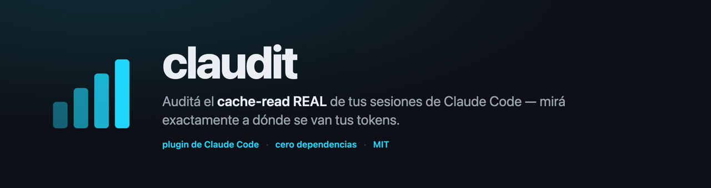
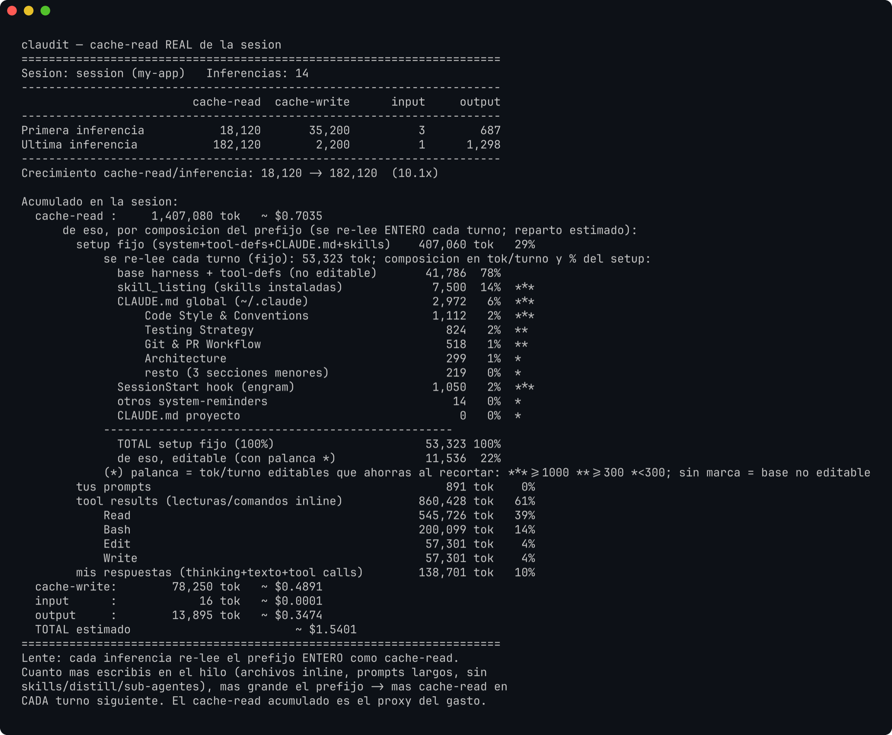
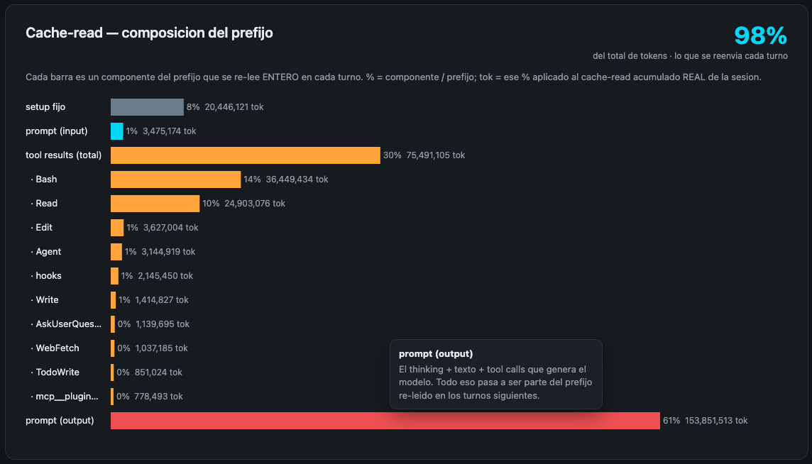
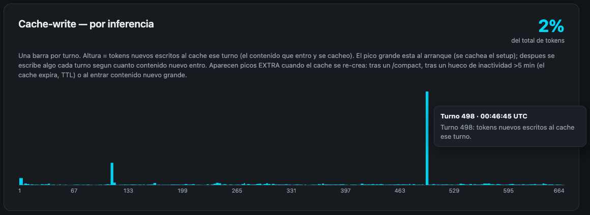
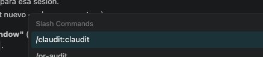

<p align="center">
  
</p>

`claudit` (Claude + audit) es un plugin de Claude Code que mide el **cache-read REAL**
de la sesión activa —no estimado— leyendo el transcript `.jsonl` que Claude Code
escribe en `~/.claude/projects/`. Da **visibilidad**, con números de la propia API,
de cuánto se re-lee en CADA turno, cómo se compone ese prefijo y **qué es lo que más
consume el contexto** — para ver si hay margen para mejorar.

> [!IMPORTANT]
> **claudit da visibilidad, no recetas.** Muestra QUÉ consume tokens y CUÁNTO —
> nada más. Qué hacer con esa información —recortar, reordenar, dividir en sub-agentes,
> o no tocar nada— queda a **criterio del usuario**: claudit **no asume que recortar sea
> mejor** ni indica cómo mejorar. Es un **medidor**, no un optimizador. El método de
> mejora corre por cuenta del usuario. Mal leído, confunde: no es una lista de cosas
> para borrar.



## About

Cada inferencia de Claude Code re-lee el prefijo **entero** del contexto como
`cache-read`. Ese re-leído es el que **domina el gasto** de una sesión larga: no es
el último prompt, es todo lo que se arrastra turno a turno (system, tool-defs,
CLAUDE.md, skills, hooks, el prompt del usuario, resultados de herramientas y las
respuestas del modelo).

**¿Y por qué se re-lee todo?** Porque el modelo es **stateless** —sin memoria—: no
recuerda nada entre turnos, arranca *de cero* en cada mensaje. Para "seguir el hilo", se
le re-manda la conversación **entera** en cada inferencia → eso es el cache-read. Es
**inevitable** (así funciona el modelo); lo que sí crece —y que claudit deja ver— es
**cuánto**, porque el contexto solo se suma, nunca se achica solo.

`claudit` abre esa caja negra:

- **Total REAL** de cache-read / cache-write / input / output, tomado del `usage`
  que reporta la API en cada inferencia (no una estimación).
- **Rampa**: cómo crece el cache-read de la primera a la última inferencia (el `Nx`).
- **Composición del prefijo**: qué parte del re-leído es setup fijo, prompt del
  usuario, tool results (por tipo: `Read`, `Bash`, …) y respuestas del modelo.
- **Columna de palanca (`*`)**: el ahorro **potencial** por turno si se decidiera
  recortar cada pieza —una oportunidad **medida**, no una recomendación— `***` ≥ 1000
  tok/turno, `**` ≥ 300, `*` < 300, sin marca = base del harness (no editable).

La lente en una frase: **cuanto más se acumula en el hilo, más grande el prefijo →
más cache-read en cada turno siguiente.** claudit muestra **cuánto y de qué**; qué
hacer con eso —si es que se hace algo— queda a criterio del usuario.

### El reporte visual (`claudit --html`)

Además del reporte de terminal, `claudit --html` genera un reporte HTML self-contained
(dark, cero dependencias, se auto-ignora en `.claudit/`) con el desglose graficado.
Cada gráfico lleva su **% del total de tokens** — la métrica que resume todo.

**Cache-read — la composición del prefijo.** El ~94% de los tokens es esto: *lo que se
reenvía en cada turno*. El **prompt (input) es 0%** — entonces, lo caro es todo lo
demás que se acumula (tool results, setup, respuestas del modelo).



**Cache-write — por inferencia.** El ~5%: contenido nuevo que se cachea. Un pico grande
al arranque y picos EXTRA cuando el caché se re-crea (tras `/compact`, un hueco `>5 min`
por expiración del TTL, o al entrar contenido nuevo grande).



## Instalación

Hay tres formas. La **A (Manage Plugins)** es la más a prueba de errores —sobre todo
en Windows/VS Code.

### A) Manage Plugins (interfaz gráfica) — recomendada

1. Abrí **Manage Plugins** en Claude Code.
2. En la pestaña de **marketplaces**, agregá el repo: `SebasCouto/claudit`.
3. Pasá a la sub-pestaña **Plugins**, seleccioná el marketplace `claudit` e instalá
   el plugin **claudit**.

### B) Dentro de Claude Code (comandos de sesión)

Escribí esto **en el input de chat de Claude Code** (NO en la terminal):

```
/plugin marketplace add SebasCouto/claudit
/plugin install claudit@claudit
```

### C) Desde la terminal, con el binario `claude`

```bash
claude plugin marketplace add SebasCouto/claudit
claude plugin install claudit@claudit
```

> [!WARNING]
> **`/plugin …` es un comando INTERNO de Claude Code, no de tu shell.** Si lo pegás en
> PowerShell, bash o la terminal de VS Code, vas a ver `El término '/plugin' no se
> reconoce…` (o `command not found`). En la terminal usá la opción **C**
> (`claude plugin …`); los `/plugin …` van solo en el chat (opción **B**), o directamente
> usá la GUI (opción **A**).

Una vez instalado, el comando `/claudit:claudit` queda disponible en **todos** los
repos — al tipear `/` aparece en el autocomplete:



> **¿No aparece el comando recién instalado?** Los slash-commands de un plugin se
> registran al **arrancar** la sesión. Recargar: en VSCode `Cmd+Shift+P → Reload
> Window`; en la CLI, salir y reabrir `claude`. Después, al tipear `/` en el input
> debe aparecer `claudit`.

### Actualizar

`claude plugin update` lee el **cache local** del marketplace — hay que refrescarlo
primero, si no no ve la versión nueva y falla con *"Plugin not found"*:

```bash
claude plugin marketplace update claudit   # 1) refresca el marketplace (git pull)
claude plugin update claudit@claudit       # 2) 0.1.0 → última
```

Reiniciar Claude Code (Reload Window / reabrir `claude`) para aplicar.

## Uso

```
/claudit:claudit             # resumen + composición del cache-read del repo actual
/claudit:claudit --detalle   # + una fila por inferencia (la rampa completa)
```

> El comando queda con namespace `plugin:comando` (por eso `claudit:claudit`).
> Al tipear `/claudit` el autocomplete lo completa.

El plugin resuelve solo qué proyecto medir: usa `$CLAUDE_PROJECT_DIR` (el repo
activo), así que aunque el plugin viva centralizado, mide la sesión actual.

### CLI standalone (sin Claude Code)

Es un único archivo Python, cero dependencias. Correr desde la raíz del repo que
se quiera auditar:

```bash
python3 plugin/claude-code/claudit.py             # sesión más reciente del cwd
python3 plugin/claude-code/claudit.py --detalle
python3 plugin/claude-code/claudit.py <uuid|archivo.jsonl>   # una sesión puntual
```

## Alcance

- **Claude-only, a propósito.** claudit está acoplado al formato de transcript de
  Claude Code y al modelo de caching de Anthropic (cache-read 0.1x + cache-write
  1.25x). No funciona con Codex u otros harnesses: usan otra ubicación, otro schema
  de `usage` y otro modelo de caché (sin `cache_write`). El nombre lo posee.
- **Cualquier modelo de Claude.** Opus, Sonnet, Haiku, Fable — mismo formato. Si
  cambia el pricing, se edita un solo dict (`PRECIO`) arriba del script.
- **Total real, reparto estimado.** El total de cache-read es de la API (real); el
  reparto interno del prefijo se estima del contenido del transcript, calibrado
  contra el prefijo real, y se declara como tal en la salida.

## Desarrollo

La versión del plugin vive en dos manifests que deben coincidir:
`plugin/claude-code/.claude-plugin/plugin.json` y el entry del plugin en
`.claude-plugin/marketplace.json`. [scripts/bump_version.py](scripts/bump_version.py)
es la fuente única del bump y sube **ambos manifests en sync**.

**Automático, vía CI (ante cada PR).** Cuando un PR se mergea a `main` y tocó
`plugin/claude-code/`, el workflow
[.github/workflows/version-bump.yml](.github/workflows/version-bump.yml) sube el patch
en los dos manifests y lo commitea de vuelta a `main` — así `claude plugin update`
siempre ve la versión nueva. **No requiere setup de los contribuidores.** (Si protegés
`main` con required-PR, dale al bot permiso de push o usá un PAT.)

**Bump manual** de `minor` / `major` cuando corresponda:

```bash
python3 scripts/bump_version.py minor   # o: major
```

## Licencia

<p align="center"><a href="LICENSE">MIT</a> · <a href="CHANGELOG.md">Changelog</a> · made by <a href="https://github.com/SebasCouto">@SebasCouto</a></p>
